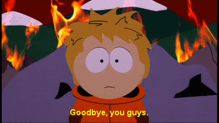

# ITMO
Этот репозиторий является навигацией по моим лабам и прочим штучкам выполненным в ИТМО/ПИиКТ/Программная инженерия/нейротех

Поступил я в 2023 году, числанулся в 2005

# 1-ый семестр
<i>Оставь надежду всяк сюда входящий<i/>

<b>Информатика:</b>
- [лаба 1](https://github.com/GeruniaSun/ITMO-informatics-lab1)
- [лаба 2](https://github.com/GeruniaSun/ITMO-informatics-lab2)
- [лаба 3](https://github.com/GeruniaSun/ITMO-informatics-lab3)
- [лаба 4](https://github.com/GeruniaSun/ITMO-informatics-lab4)
- [лаба 5](https://github.com/GeruniaSun/ITMO-informatics-lab5)
- [лаба 6](https://github.com/GeruniaSun/ITMO-informatics-lab6)

<b>Прога:</b>
- [лаба 3](https://github.com/GeruniaSun/ITMO-programming-lab3)
- [лаба 4](https://github.com/GeruniaSun/ITMO-programming-lab4)
# 2-ой семестр
<i>Не жили богато, нечего и начинать<i/>

<b>Прога:</b>
- [лаба 5](https://github.com/GeruniaSun/ITMO-programming-lab5)
- [лаба 6](https://github.com/GeruniaSun/ITMO-programming-lab6)
- [лаба 7](https://github.com/GeruniaSun/ITMO-programming-lab7)
- [лаба 8](https://github.com/GeruniaSun/ITMO-programming-lab8)

<b>БДшки:</b>
- [лаба 1](https://github.com/GeruniaSun/ITMO-DB-lab1)
- [лаба 2](https://github.com/GeruniaSun/ITMO-DB-lab2)
- [лаба 3](https://github.com/GeruniaSun/ITMO-DB-lab3)
- [лаба 4](https://github.com/GeruniaSun/ITMO-DB-lab4)

# 3-ий семестр
<i>Скучно, когда всё хорошо</i>

<b>Веб:</b>
- [лаба 1](https://github.com/GeruniaSun/ITMO-web-lab1)
- [лаба 2](https://github.com/GeruniaSun/ITMO-web-lab2)
- [лаба 3](https://github.com/GeruniaSun/ITMO-web-lab3)
- [лаба 4(бэкик)](https://github.com/GeruniaSun/ITMO-web-lab4-back)
- [лаба 4(фронтик)](https://github.com/GeruniaSun/ITMO-web-lab4-front)
  
<b>ДГМА:</b>
- [лекции парт ван](https://miro.com/app/board/uXjVKhrxVQM=/?share_link_id=508000302890)
- [лекции парт ту](https://miro.com/app/board/uXjVLTtuxGg=/?share_link_id=775120591556)
- [лекции парт фри](https://miro.com/app/board/uXjVLGGyp2Q=/?share_link_id=154103931834)
- [лекции парт фор](https://miro.com/app/board/uXjVL2qT70A=/?share_link_id=423687423473)
- [наши попытки разобрать кр2](https://miro.com/app/board/uXjVL9yytgM=/?share_link_id=582905590677)
- [наши попытки разобрать кр3](https://miro.com/app/board/uXjVLz_HkpM=/?share_link_id=658651950885)
  
<b>ТФКП:</b>
- [лекции парт ван](https://miro.com/app/board/uXjVKiZxeRg=/?share_link_id=594363267686)
- [лекции парт ту](https://miro.com/app/board/uXjVLNzja9Y=/?share_link_id=721102733526)
- [не лекции](https://miro.com/app/board/uXjVLyLNzdM=/?share_link_id=198640104618)

<b>Физикс:</b>
- [лабулька](https://github.com/GeruniaSun/ITMO-physics-mechanics)

# 4-ый семестр
<i>Хорошо жить хорошо и плохо - плохо</i>

<b>Алгосы:</b>
- [лекции](https://miro.com/app/board/uXjVLiBtinA=/?share_link_id=974986822773)
- [задачи со степика(пока что 11 из 17)](https://github.com/GeruniaSun/ITMO-algs-stepik)
- [задачи с кодефорсес](https://github.com/GeruniaSun/ITMO-algs-codeforces)

<b>Матстат: </b>
- [лекции парт ван](https://miro.com/app/board/uXjVLhxrlKs=/?share_link_id=801461673568)
- [лекции парт ту](https://miro.com/app/board/uXjVIPtQVkM=/?share_link_id=27987446715)
- [лекции парт фри](https://miro.com/app/board/uXjVI9bhq9c=/?share_link_id=469247779445)
- [лаба 1](https://colab.research.google.com/drive/1D1cuzKYlYBkijXyZ_9VVJobDqyyCbG4A?usp=sharing)
- [лаба 2](https://colab.research.google.com/drive/1S5wBOJF6aisHF6rIUYxNdfP2iwlqiaW5?usp=sharing)
- [лаба 3](https://colab.research.google.com/drive/1c0oprSK-uHNthKns0E96I4YWY3xHZ21c?usp=sharing)

<b>Метопты:</b>
- [лекции парт ван](https://miro.com/app/board/uXjVLi-TUTo=/?share_link_id=410088224423)
- [лекции парт ту](https://miro.com/app/board/uXjVIE_W780=/?share_link_id=616530430557)

<b>ОПИ:</b>
- [лаба 1](https://docs.google.com/document/d/1LS2Ss2lClq3pITVmR36E-DKJr-BlHZ0sHRxMtFzTYQc/edit?usp=sharing)
- [лаба 2](https://github.com/GeruniaSun/ITMO-OPI-lab2)
- [лаба 3(антик)](https://github.com/GeruniaSun/ITMO-OPI-lab3-ant)
- [лаба 3(градлик)](https://github.com/GeruniaSun/ITMO-OPI-lab3-gradle)
- [лаба 4](https://github.com/GeruniaSun/ITMO-OPI-lab4)
  
<b>Физикс:</b>
- [тут +- все интересное](https://github.com/GeruniaSun/ITMO-physics-electromagnetism)
- [наш супер мега проект](https://github.com/deadxraver/physics-2)

# 5-ый семестр
<i>думаю</i>

<b>Биометрия:</b>
- [доска(там в основном про онлайн-курс)](https://miro.com/app/board/uXjVJMhRxpU=/?share_link_id=683995340541)
- [лаб 1](https://docs.google.com/document/d/1heI0OUXoer1k9BUn6UJvOXMqRgFdi7mU-KOOLdvq2LU/edit?usp=sharing)
- [лаб 2](https://colab.research.google.com/drive/1r9xBpggC4qaHbGGuKnuf19M8-GU4Lrmp?usp=sharing)

<b>СИИ:</b>
- [секретный отчет](https://docs.google.com/document/d/1wlsWGFfbRbrdnyZHVWoDpX2wpLBxEgO5H8zQNSoK8kw/edit?usp=sharing)
- [лаба 1](https://colab.research.google.com/drive/1XfJoom1Xx5MJ7KZei1I860oeoFaymTY6?usp=sharing)
- [лаба 2](https://colab.research.google.com/drive/19PMh9VlBcRoCqRanvPSwgnAVONOeysao?usp=sharing)

<b>ФП:</b>
- [лаб 0](https://docs.google.com/document/d/1j-V5bp5wLR7pcqhXuq1s-2wWiWT9SFryEL2rEoxa_rw/edit?usp=sharing)

<b>Нейроинформатикс:</b>
- [лаб 1](https://colab.research.google.com/drive/1oCKZWTMaqix_kE7Y_LlScRHT-PaUEYLm?usp=sharing)

# Всяко разное
- [доп лекция о численых методах исчиления интегралов](https://github.com/GeruniaSun/ITMO-advanced_calculus-optional_lection)
- [лекции Лисицыной Л.С. о нейросетях (баздискретка нейро)](https://github.com/GeruniaSun/ITMO-lections-NeurolinksLisicina)

